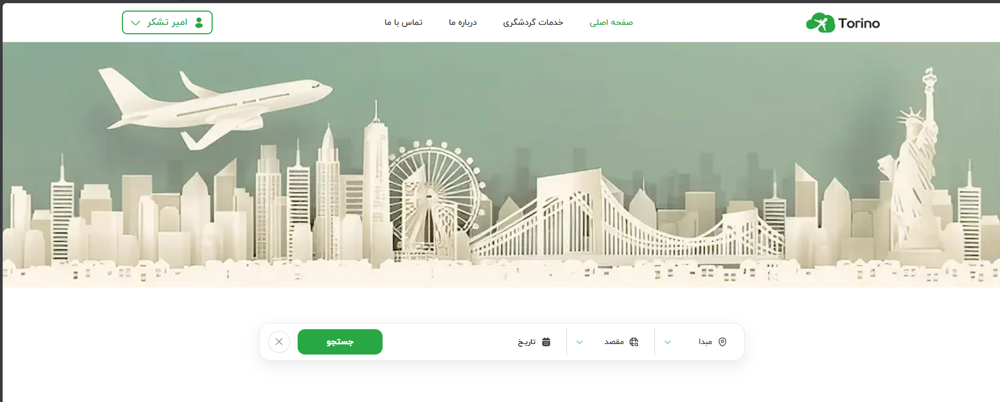
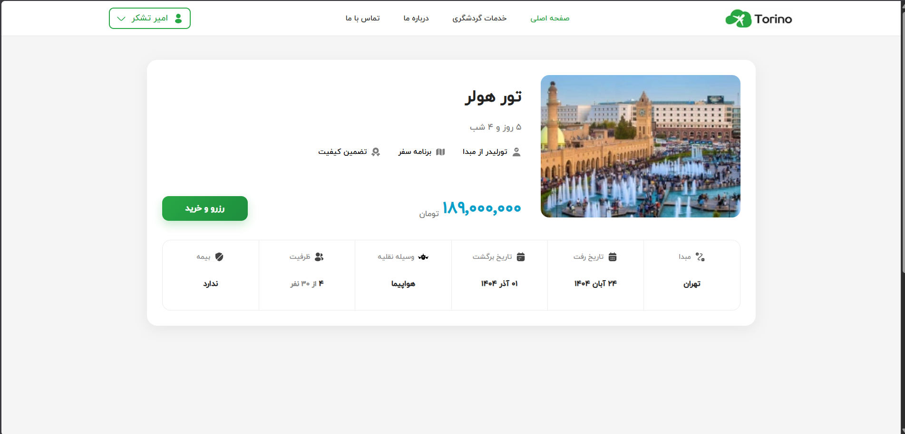
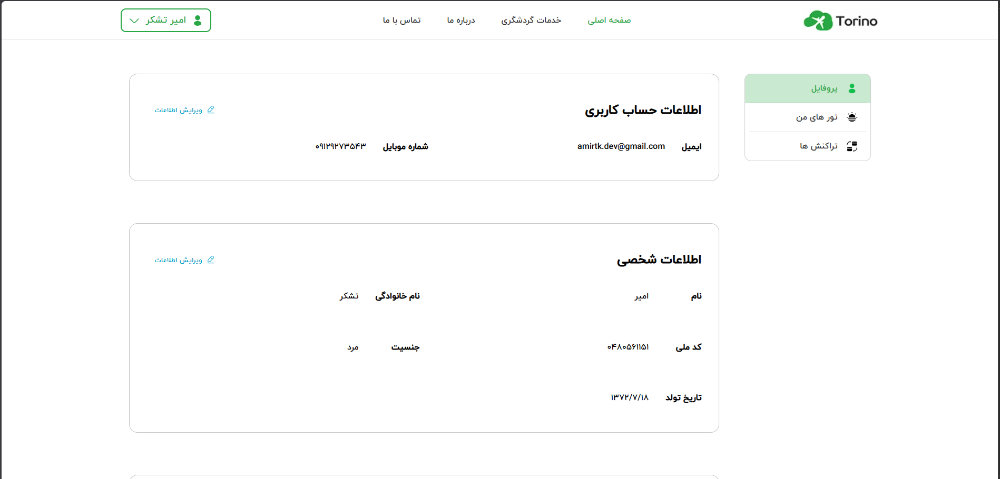

# ✈️ Torino Travel Agency

A modern travel agency web application built with **Next.js**, focused on tour reservation, authentication, user profile management, and a smooth user experience.

---

## 📸 Preview





---

# ✨ Features

- 🔍 Search tours by origin, destination and date
- 🧳 Tour details page
- 🛒 Tour reservation flow
- 👤 Authentication
- 🧾 User profile management
- 🎫 My Tours page
- 💳 Checkout page
- 📑 Transactions page
- 🚫 Custom 404 page
- ✈️ Custom animated loading components
- 📱 Fully responsive design

---

# 🛠 Tech Stack

### Frontend

- Next.js
- React
- CSS Modules
- React Hook Form
- TanStack Query
- React Hot Toast
- Zaman Date Picker

### Backend

- REST API

---

# 📂 Project Structure

```
components/
│
├── layout/
├── module/
├── modal/
├── templates/
│
pages/
│
services/
│
utils/
│
provider/
```

---

# 🚀 Getting Started

Clone the project

```bash
git clone https://github.com/amir-tashakkor/torino.git
```

Install packages

```bash
npm install
```

Run development server

```bash
npm run dev
```

Build production

```bash
npm run build
```

Run production

```bash
npm start
```

---

# 📱 Responsive Design

The project is optimized for

- Desktop
- Laptop
- Tablet
- Mobile

using responsive layouts and CSS Modules.

---

# 🎯 Main Pages

- Home
- Tour Details
- Checkout
- Payment (Demo)
- User Profile
- My Tours
- Transactions
- 404 Page

---

# 📌 Notes

This project was developed as the final project of a Frontend Bootcamp.

Some backend endpoints were extended and customized during development to support additional frontend features.

---

# 👨‍💻 Developed By

**Amir Tashakkor**

Frontend Developer

Focused on building modern web applications with React & Next.js.

---

⭐ Thanks for visiting this project!
